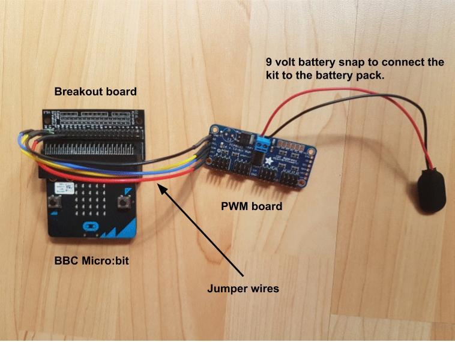
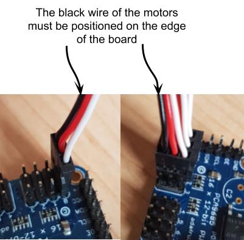

**********************
Connecting the Parts
**********************
The robot is made from parts designed by Dr Gonzales-Gómez. Instructions for
the latest design is `here <http://www.iearobotics.com/wiki/index.php?title=Módulos_REPYZ>`_.
You can also use the older design, `here <http://www.iearobotics.com/wiki/index.php?title=M%C3%B3dulos_REPY-1>`_.

Although the micro:bit can drive up to 3 small servo motors, we have decided to use a second board, a PWM board, to connect the micro:bit to the servos. We've done this for two reasons:

*	The micro:bit works on a 3.3V circuit but the servos we use work on a circuit of about 5V. This means that we can’t just connect the two together anyway.

*	We can connect up to 16 servos to the micro:bit using an interface board so we could make a very long snake or caterpillar.

*High level view of the micro:bit, breakout board and PWM board*

In this picture you can see that the micro:bit is plugged in to a breakout
board which is connected, in turn, to a PWM board using some
small wires. The PWM board communicates with the micro:bit using a special digital communications channel called I2C. We have written some code to hide these details from you so that you can focus on getting the caterpillar moving.

How to connect the parts
------------------------
Follow the steps below to make the connections but please note:

**DO NOT CONNECT THE BATTERY TO YOUR KIT UNTIL YOUR CIRCUIT HAS BEEN CHECKED**

Step 1: Connect the micro:bit to the PWM board
^^^^^^^^^^^^^^^^^^^^^^^^^^^^^^^^^^^^^^^^^^^^^^
.. image:: pictures/jumper_wires.jpg
*Connecting the micro:bit to the PWM board*

You will need 4 female to female jumper wires and you must connect the right
pins together. Use this table to match up the pins.

+-------------+-------------+------------+
|            Connection Table            |
+=============+=============+============+
| Purpose of  | Micro:bit   | PWM board  |
| the pin     | pin label   | pin label  |
+-------------+-------------+------------+
| Power       |      3V     |     VCC    |
+-------------+-------------+------------+
| Ground      |      0V     |     GND    |
+-------------+-------------+------------+
| Clock Line  |      19     |     SCL    |
+-------------+-------------+------------+
| Data Line   |      20     |     SDA    |
+-------------+-------------+------------+

Step 2: Plug the motors into the PWM board
^^^^^^^^^^^^^^^^^^^^^^^^^^^^^^^^^^^^^^^^^^^

*Plugging the motors into the PWM board*

The servo motors should be connected to the PWM board this way round with the black wire on the outside of the board. You can see this clearly on the left where there is a servo connected in position 0. It’s easier if you start at 0 and work up. You can start off by just connecting 1 motor and add more as you use them.
