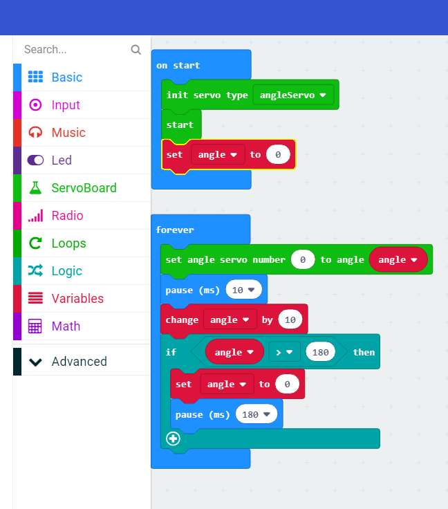

****************
Forward and Back
****************

Well done, you have got the motor moving and you can see that it moves from 0° to 180° as you press the button. Now we need to change the code so that the motor moves without human intervention so that our caterpillar can crawl.

New code
-----------------------
We are going to move some of the code around. Any code that you put in the ``forever`` loop will keep repeating over and over as its name suggests. Change your code as follows:

1. Move the code in the ``on button A pressed`` loop to the ``forever`` loop.
2. Delete the ``on button A pressed`` loop.
3. Add a pause of 180 milliseconds after the ``angle`` variable has been reset to 0. This is so that the micro:bit will wait for the motor to move to angle 0° before moving it again.
4. Add another 10 ms pause so that the micro:bit will wait for the servo motor to move each time around the ``forever`` loop.

Your code should now look like this:

-----------------------
Experiment
-----------------------
Try the program out. Upload your code to the micro:bit. Did it work? Keep experimenting until you are satisfied with the outcome.
