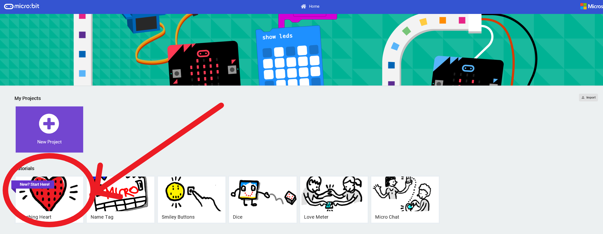
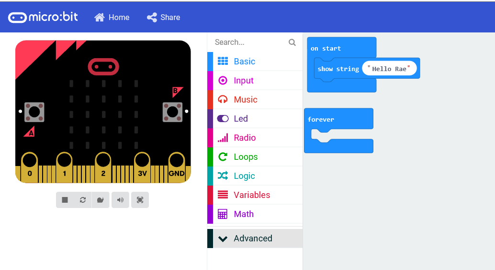
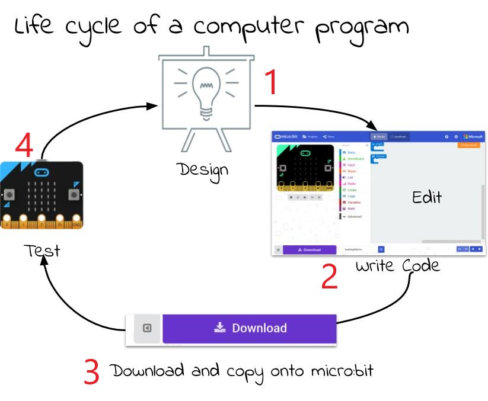

****************************
Micro:bit - Getting Started
****************************

The BBC micro:bit is a tiny computer that you can use to create all kinds of projects from robots to musical instruments –
the possibilities are endless. There are a myriad of features that you can use in your designs:

 * 25 red LED lights that can flash messages.
 * Two programmable buttons (A and B) that can be used to tell the micro:bit when to start and stop things.
 * A thermistor to measure the temperature.
 * A light sensor to measure the change in light.
 * An accelerometer to detect motion.
 * A magnetometer to tell you which direction you’re heading in.
 * A radio and a Bluetooth Low Energy connection to interact with other devices.

.. image:: pictures/microbit-front-back.jpg
   :scale: 60%
   :align: center

Let's create your first micro:bit program; after that, it's really up to you to discover more.

===================
Your First Program
===================

Go to the micro:bit code editor here: `https://makecode.microbit.org <https://makecode.microbit.org>`_, the homepage should look similar to the picture here, click through on and complete the Flashing Heart tutorial:

Can you make a change to your code? How about making the micro:bit display: "Hello <Your name>"? When you've done that, find out what happens when you put the code in the start block instead of the forever block like this:

Well done, you have written your first programs. Carry on and see what else you can do; try some of the other projects and search for others online.

Coding using the micro:bit is composed of these 4 steps. You can expect to go around the loop  quite a few times before you get your code working.

