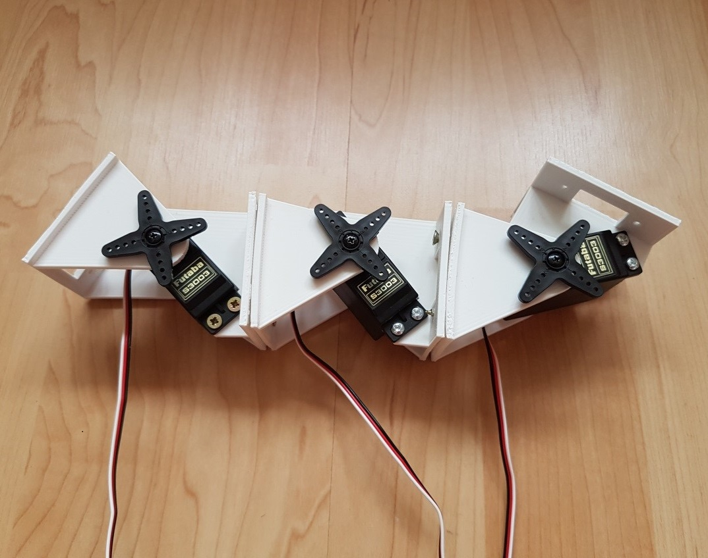
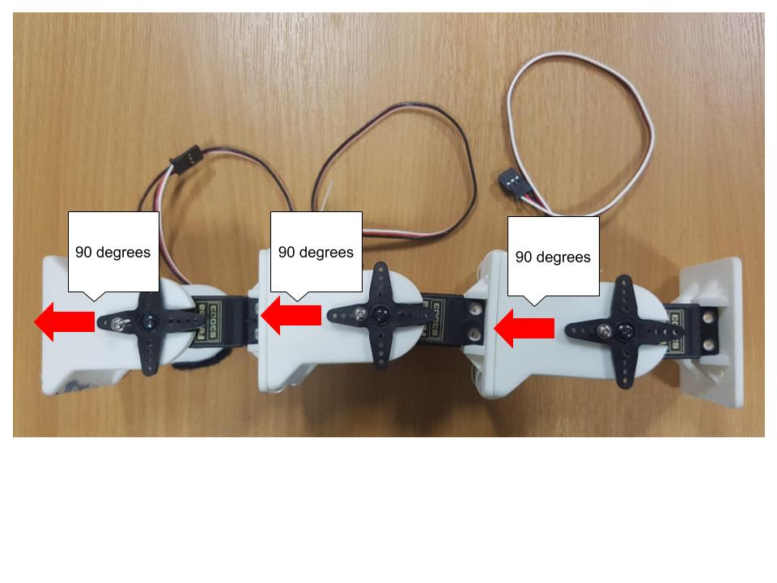

.. UCL Micro:bit Robotics documentation master file, created by
   sphinx-quickstart on Thu Apr 26 20:38:56 2018.
   You can adapt this file completely to your liking, but it should at least
   contain the root `toctree` directive.

========================
UCL's Micro:bit Robotics
========================

This project is designed to give students an introduction to robotics with a
robot inspired by the natural world. There's no need to know how to code before
diving in but we can assure you that once you have tried it, you won't want to stop.
The project was designed by `Professor Stephen Hailes <http://www.cs.ucl.ac.uk/people/S.Hailes.html/>`_, a robotics expert and dedicated educator.
You will use the micro:bit to make the robot move. `Professor Stephen Hailes <http://www.cs.ucl.ac.uk/people/S.Hailes.html/>`_ has written a servo motor library for the micro:bit to make this easier.

The robot is a caterpillar (or maybe a snake, depending on the motion style) which was designed by
`Dr Juan González-Gómez <http://www.iearobotics.com/wiki/index.php?title=Juan_Gonzalez:Main>`_.

Caterpillar robot designed by `Dr Juan González-Gómez <http://www.iearobotics.com/wiki/index.php?title=Juan_Gonzalez:Main>`_

------------------------
Building Your Own Robots
------------------------
Take a look at Dr Gómez's instructions for making and building the units for the robot. The latest design is `here <http://www.iearobotics.com/wiki/index.php?title=Módulos_REPYZ>`_.
You can also use the older design, found `here <http://www.iearobotics.com/wiki/index.php?title=M%C3%B3dulos_REPY-1>`_.

*Note:* When the robot is flat on the table the servo motors should be set to 90 degrees. You will need to set the motors to a 90 degree angle before attaching the units together.

Caterpillar robot designed by `Dr Juan González-Gómez <http://www.iearobotics.com/wiki/index.php?title=Juan_Gonzalez:Main>`_

---------
Contents
---------

.. toctree::
   :maxdepth:1

   getting_started
   caterpillar_robot
   motors
   connections
   getReadyToCode
   movingMotors
   forwardAndBack
   oneTwoThree
   references

To download this documentation in pdf, epub or html format, click on the link at the bottom of the sidebar on the left.

If you would like to contribute to the documentation or create your own flavour, go ahead! Use git to fork the repository. The documentation is hosted on `ReadTheDocs <https://readthedocs.org>`.
