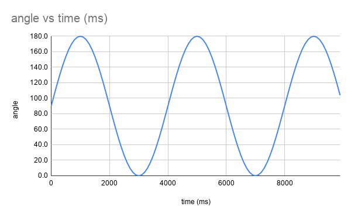

***********************
Doing it as a sine wave
***********************
This is an extension activity.

As it happens, many things in biology happen like sine waves. That's true for this kind of movement - what we'd like to see is the following:

What this means is the change in angle is slower the closer you get to 180° and to 0°. So it starts slowly, then gets faster, then slows down, changes direction, and so on.

The function for the angle is:
``angle = 90 + 90 * Math.sin(2 * PI * running_time / 4000)``

Note: the ``Math.sin()`` function requires that the number of degrees is expressed as radians. 360° is 2 * PI radians.

* ``running_time`` is the amount of time since the micro:bit was turned on in ms.
* The 4000ms is the amount of time it takes to go from angle 0° back to 0° again. Make this number bigger to go slower.
* Sine values vary between 0 and 1 so the angle varies between 0° and 180° as things stand. The **90 *** is the amplitude of the wave and here we want it to go through all 180° of motion. Make this smaller if you want less; if the value was, say 40, then the movement would vary between 60° and 130°.
* The **90 +** is the centre position position of the movement. The servo moves equally either side of that centre. You could choose to centre the movement in a different place. If this was say, 100 and the amplitude was 40 then the servo would move between 60° and 140°.

Congratulations! You made an oscillator. The nice thing about sinusoidal oscillators is that putting things out of phase is easy. Say you wanted two sine waves 90° out of phase then set:``angle1`` = sin(t) and ``angle2`` = sin(t + 90)
