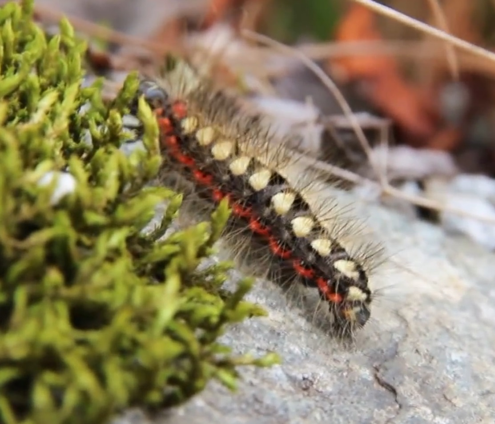

*****************
Caterpillar Robot
*****************

Aims
----
We’re going to build a crawling robot that’s inspired by a caterpillar.
The first thing we should do is to take a look at how a caterpillar moves. Take a
look at these YouTube clips:

Source: `Caterpillar on the move (Lampe,2013) <https://www.youtube.com/watch?v=fRVGWCSij_M>`_

* https://www.youtube.com/watch?v=a9Km0edRFG4

You can see from the video that a wave passes along the caterpillar so we’ll
try to make our robot mimic that.

 but, as you can see from the video, a wave passes along the caterpillar so we’ll
try to mimic that.

For this project, the robot we are going to build will only have
3 body segments, we’re going to need some power to move each segment and we
will use a motor, called a servo motor to do this. We'll control the motors
using a program written on a micro:bit.
