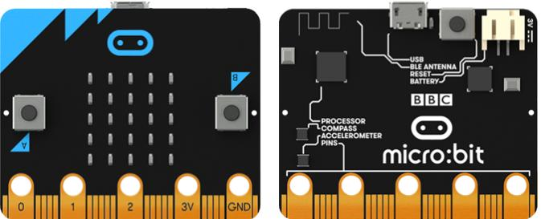
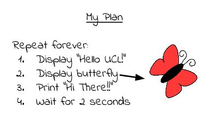
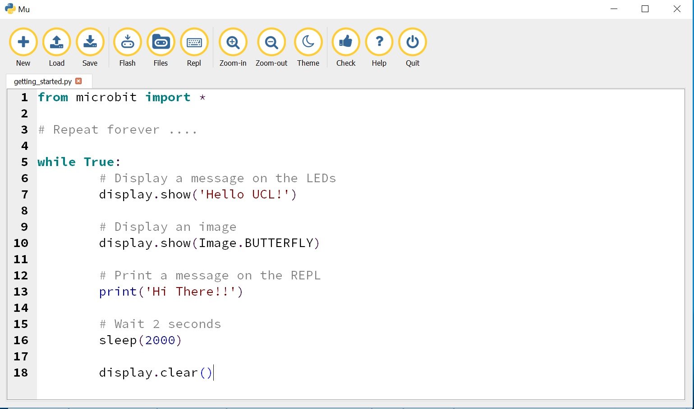

*****************
Caterpillar Robot
*****************

Aims
----
We’re going to build a crawling robot that’s inspired by some types of caterpillar.
How does a caterpillar move? Take a look at these YouTube clips:
https://www.youtube.com/watch?v=fRVGWCSij_M
or
https://www.youtube.com/watch?v=a9Km0edRFG4

The robot we are going to build will only have 3 body segments but, as you can
see from the video, a wave passes along the caterpillar so we’ll try to mimic that.
For this project, we’re going to need some power, provided by a particular type
of motor called a servo motor, and we’re going to need to control that using a
program written on a Micro:bit.

Now you will create your first micro:bit program; after that, well we've listed a few ideas but it's really up to you.

Your First Program
===================
Coding using the micro:bit is composed of these 4 steps. You can expect to go around the loop  quite a few times before you get your code working.

.. image:: pictures/microbit_lifecycle.jpg
   :scale: 60%
   :align: center

Design the Code
----------------

First of all you are going to write a program to display the message “Hello UCL!” followed by an image on the display of your micro:bit. There's not much planning and design to do here, but just so that you understand what a plan might look like:

Write the Code
--------------
We will use a special text editor to write our programs, it looks like the one shown here:

Let's go through this line-by-line::

	while True:

This means do something (whatever follows this statement and is indented) forever and ever and ever. This is called  a loop, it's a bit like a video clip that's stuck on repeat.  ``True`` and ``False`` have a special meaning in python. ``True`` is always, well ``True``. The rest of the program is straightforward::

	from microbit import *

	while True:
    	    display.show('Hello UCL!')
            display.show(Image.BUTTERFLY)
	    print('Hi There!!!')
    	    sleep(2000)

This displays ``Hello UCL`` on the LED display one character at a time and then shows the butterfly.
The statement ``print('Hi There!!')``, will print the message in the REPL. Press the REPL button in the menu now to show the REPL window:

.. image:: mu_repl_button.jpg
   :scale: 60%
   :align: center

The REPL window shows us messages from the micro:bit and also allows us to send commands directly to the micro:bit. For now, we'll just be using the REPL to see messages that we print and error messages.

You might be wondering why we've asked the
micro:bit to sleep for ``2000``! This value is in microseconds so we've really only asked it to sleep for 2 seconds. That will give us enough time to see the image before the micro:bit starts all over again.

Upload the Code
----------------
Final checks. Is your micro:bit connected to your computer? Yes? Then press the flash button:

.. image:: mu_flash.jpg
   :scale: 60%
   :align: center

You should see the message and the image displayed on the micro:bit and the message "Hello There!!" should be printed on the REPL.

.. image:: mu_first_program_repl.jpg
   :scale: 60%
   :align: center

Make a change
-------------
Change the text that is displayed on the screen and make it scroll across the LED display. You can do this by changing the word ``show`` to ``scroll``. Don't forget to save your program and remember to  ``flash`` the new code to the micro:bit.

.. image:: high_five.png
   :scale: 60%
   :align: center

You have written your first program. Carry on and see what else you can do with the micro:bit.
