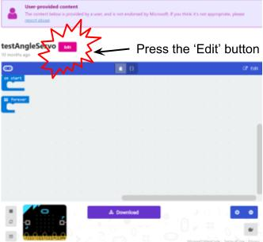

**********************
Making the motors move
**********************
We will be programming the micro:bit using the makecode programming environment with some added software to drive
the motors.

To start coding, open a browser, and go to this link: https://goo.gl/nKmyrn

When you see the screen below, press the 'Edit' button.

*Microsoft makecode*
