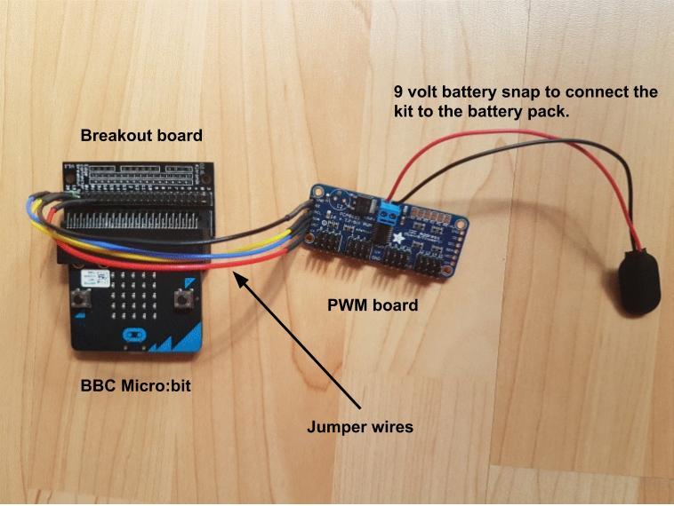
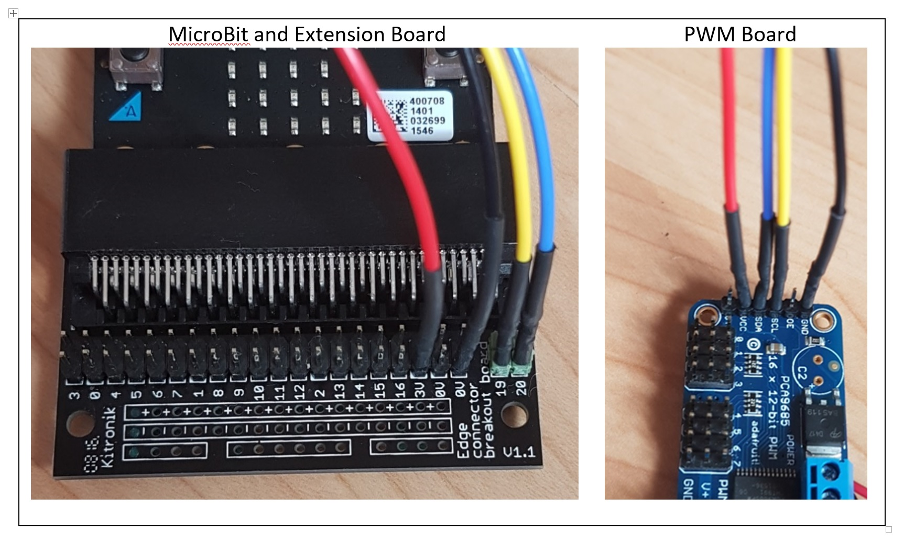

**************************************
Connecting the motors to the micro:bit
**************************************
Although the micro:bit can drive up to 3 servo motors, we have decided to use a second board to connect the MicroBit to the servos, for two reasons:

*	The micro:bit works on a 3.3V circuit, and the servos work on ~5V. This means that we can’t just connect the two together anyway.

*	We can connect up to 16 servos to the MicroBit using an interface board – we could make a very long snake or Caterpillar.

*High level view of the micro:bit, breakout board and PWM board*

In this picture you can see that the micro:bit will plugged in to a breakout
board which is connected, in turn, to a PWM board using some
small wires. The PWM board communicates with the MicroBit using a special digital
communications channel called I2C. We have written some code to hide these details
from you so that you can focus on getting the caterpillar moving.

How to connect the parts
------------------------
Follow the steps below to make the connections but please note:

**DO NOT CONNECT THE BATTERY TO YOUR KIT UNTIL YOUR CIRCUIT HAS BEEN CHECKED**

Step 1: Connect the micro:bit to the PWM board
Use 4 female to female jumper wires to connect the breakout board to the PWM board.

*Connecting the micro:bit to the PWM board*
