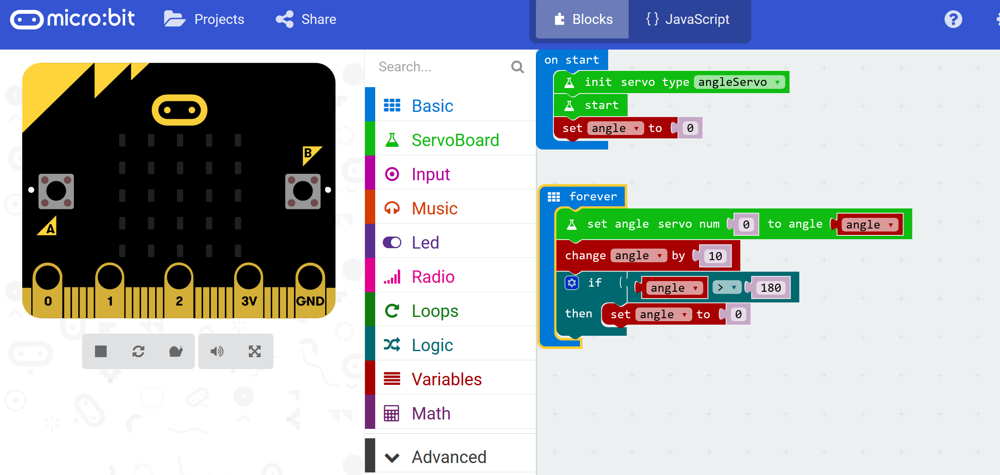
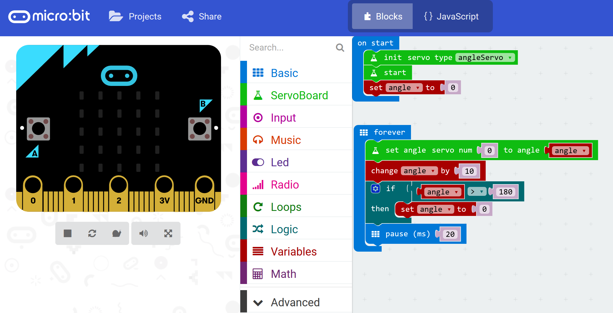

****************
Forward and Back
****************
Well done, you have got the motor moving and you can see that it moves from 0° to 180° as you press the button. Now we need to change the code so that the motor moves without human intervention so that our caterpillar can crawl.
-----------------------
New code
-----------------------
We are going to move some of the code around using these two steps.

Step 1:
^^^^^^
Any code that you put in the ``forever`` loop will keep repeating over and over as its name suggests. Move the code in the ``on button A pressed`` loop to the ``forever`` loop. Delete the ``on button A pressed`` loop. Your code should now look like this:

Step 2:
^^^^^^
Now add a pause of 20 milliseconds at the end of the ``forever`` loop to give the motor a chance to move.

Step 3:
^^^^^^
Try the program out. Upload your code to the micro:bit. Did it work? Keep experimenting until you are satisfied with the outcome.
