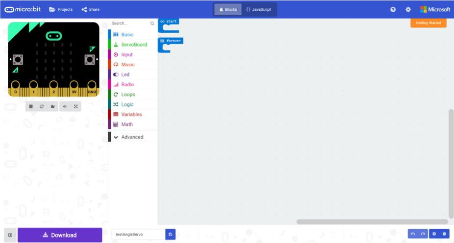

*****************
Get ready to code
*****************
We will be programming the micro:bit using the makecode programming environment with some added software to drive the motors.

To start coding, open a browser, and go to this URL: `https://goo.gl/nKmyrn <https://makecode.microbit.org/_85wKMW2KM0u1>`_

When you see the screen below, press the 'Edit' button.

.. image:: pictures/OpenPXT.jpg
  :scale: 100%
*Microsoft makecode*

You should see a screen like the one below, you are now ready to code:

