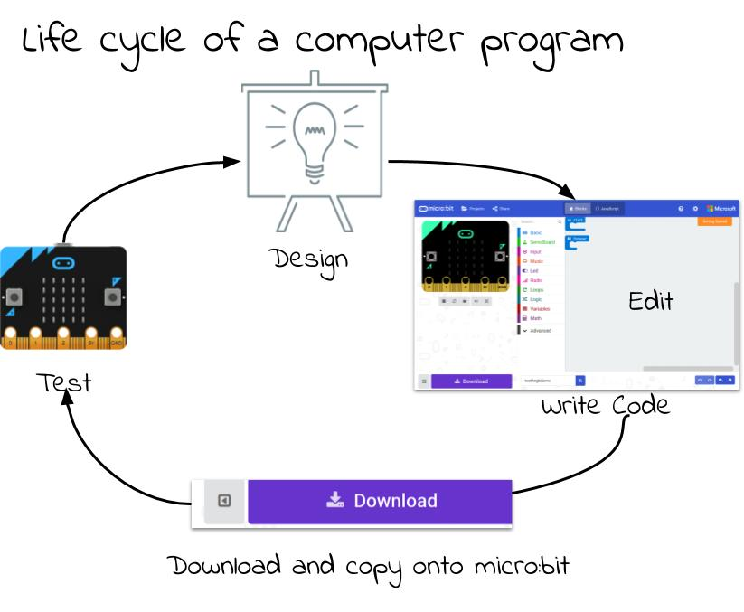
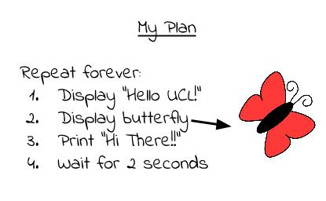
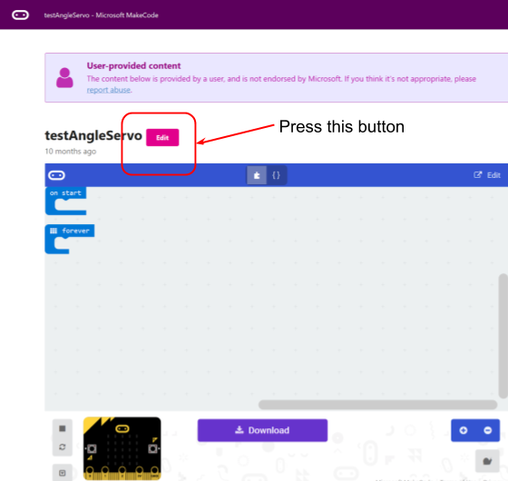
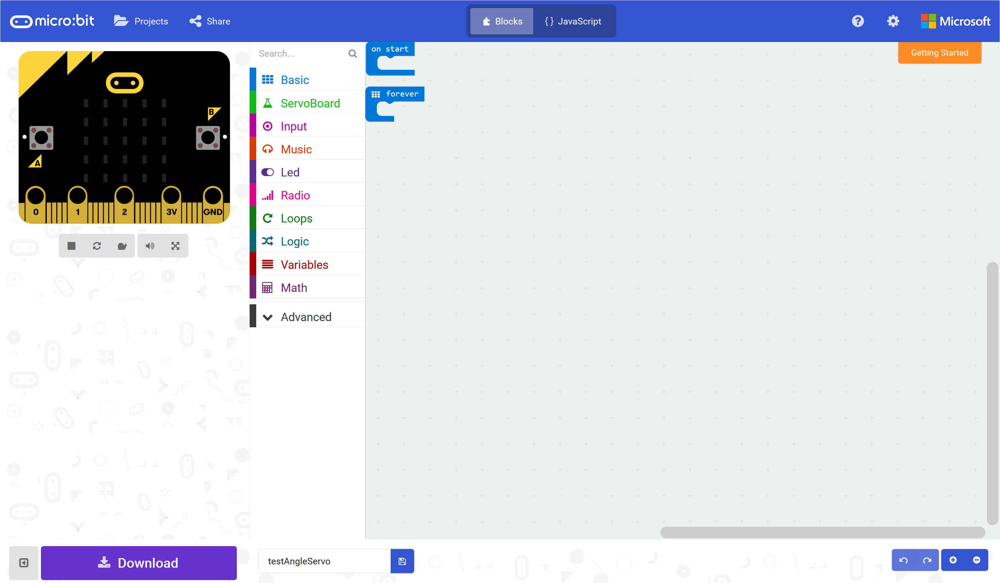
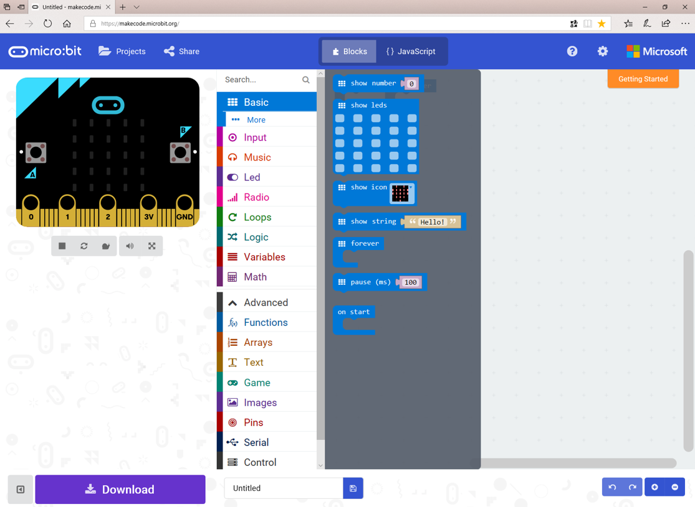
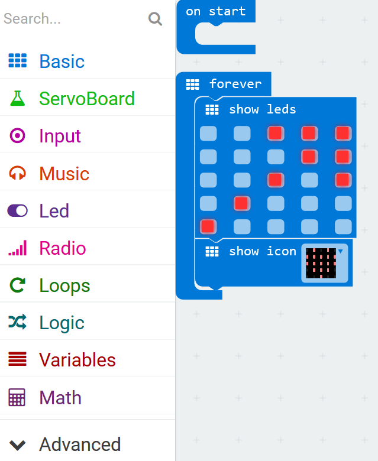

****************************
Micro:bit - Getting Started
****************************

The BBC micro:bit is a tiny computer that you can use to create all kinds of projects from robots to musical instruments –
the possibilities are endless. There are a myriad of features that you can use in your designs:

 * 25 red LED lights that can flash messages.
 * Two programmable buttons (A and B) that can be used to tell the micro:bit when to start and stop things.
 * A thermistor to measure the temperature.
 * A light sensor to measure the change in light.
 * An accelerometer to detect motion.
 * A magnetometer to tell you which direction you’re heading in.
 * A radio and a Bluetooth Low Energy connection to interact with other devices.

.. image:: pictures/microbit-front-back.jpg
   :scale: 60%
   :align: center

Let's create your first micro:bit program; after that, well we've listed a few ideas but it's really up to you.

===================
Your First Program
===================
Coding using the micro:bit is composed of these 4 steps. You can expect to go around the loop  quite a few times before you get your code working.

Design the Code
----------------

First of all you are going to write a program to display the message “Hello UCL!” followed by an image on the display of your micro:bit. There's not much planning and design to do here, but just so that you understand what a plan might look like:

Write the Code
--------------

We will be programming the micro:bit using Microsoft's makecode programming environment with some added software to drive the motors. To start coding, open a browser, and go to this URL: `https://goo.gl/nKmyrn <https://makecode.microbit.org/_85wKMW2KM0u1>`_. When you see the screen below, press the ``Edit`` button.

You should see a screen like the one below and you are now ready to make the micro:bit, and eventally your robot, do something.

*Microsoft makecode programming environment*
  :scale: 60%

Choose one or more of the blocks in the ``Basic`` menu by clicking on the menu.

*makecode Basic menu*
  :scale: 60%

Drag it into ``forever`` loop in the work area like this:

*Using the LEDs*
    :scale: 50%

What is happening here? Anything that you put in the ``forever`` loop will repeat over and over again.

Upload the Code
----------------
Final checks. Is your micro:bit connected to your computer? Yes? Then press the ``Download`` button. Drag the file that's downloaded onto the micro:bit which will appear as a device in your File Explorer.

Make a change
-------------
What else can you do? Try it out. You have written your first program, carry on and see what else you can do with the micro:bit. There are lots more resources online.
