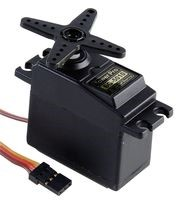
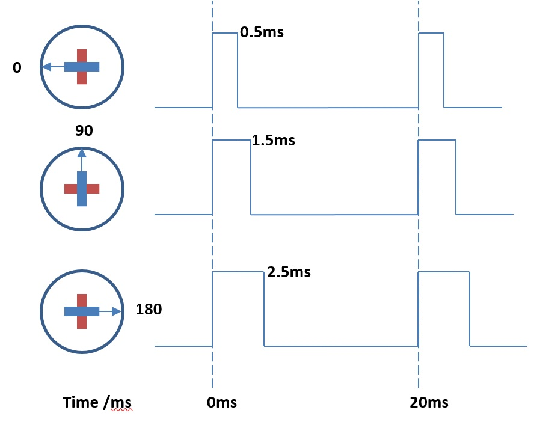

************************
Servo Motors
************************
Let's begin by taking a look at the servo motor. There are two types of
servo – the first type is one where you can choose an angle to which the arms
should rotate; the second goes round and round at a speed you set. We’re going
to use the first type shown here:

*Futaba S3003 servo motor*

Servos are used all over the place in both daily life and in robotics. A servo
might retract the tray of a DVD player or might be used in radio controlled
vehicles and aeroplanes to control the rudder of a boat, or the ailerons - the
moveable flaps on the wings of a plane.

.. image:: pictures/Aileron_roll.gif
  :scale: 60 %
*An animation of an airplane rolling via its ailerons (NASA, 2013)*

Pulse Width Modulation (PWM)
----------------------------
The angle of the arms on the motor is controlled by sending the motor small electrical
pulses. This technique is called a pulse width modulation (PWM). Look at the
diagram below: a pulse of 0.5 milliseconds (ms) will cause the motor to set the rotor
to 0°. A longer pulse of 1.5 ms will set the rotor to 90° and a pulse of 2.5 ms
will move the rotor to 180°.

*The length of the electical pulse determines the rotor position.*

In the next section, we'll learn how to connect the motors to the micro:bit.
