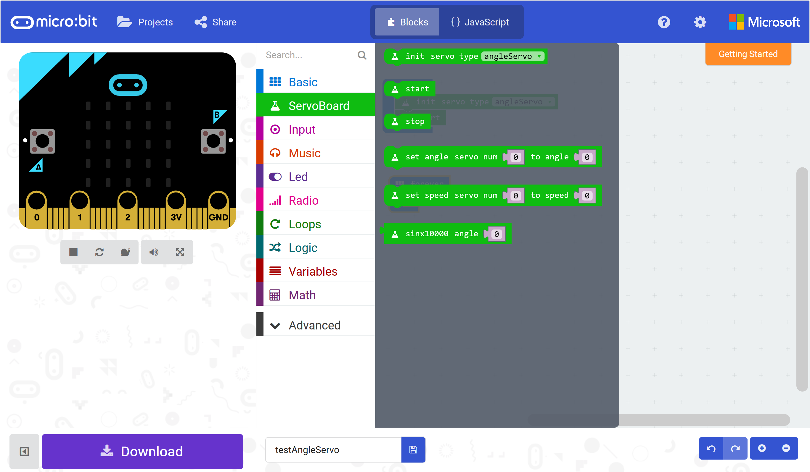
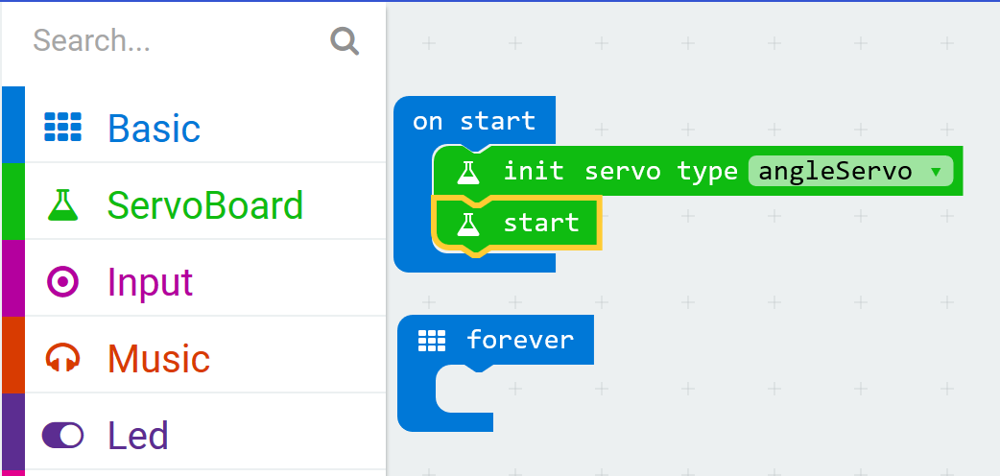
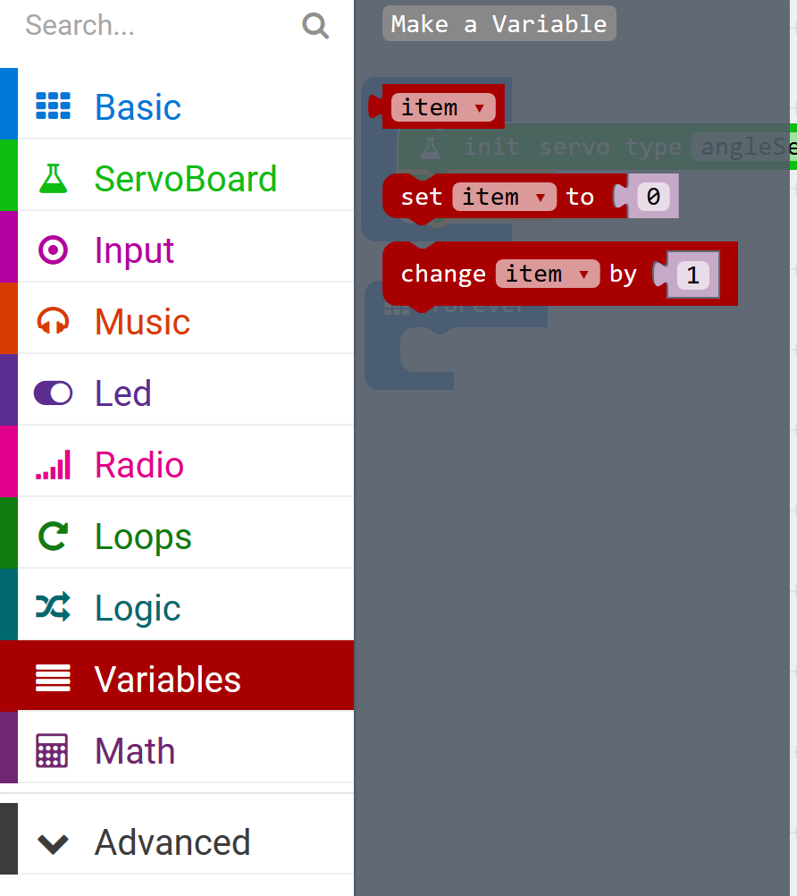
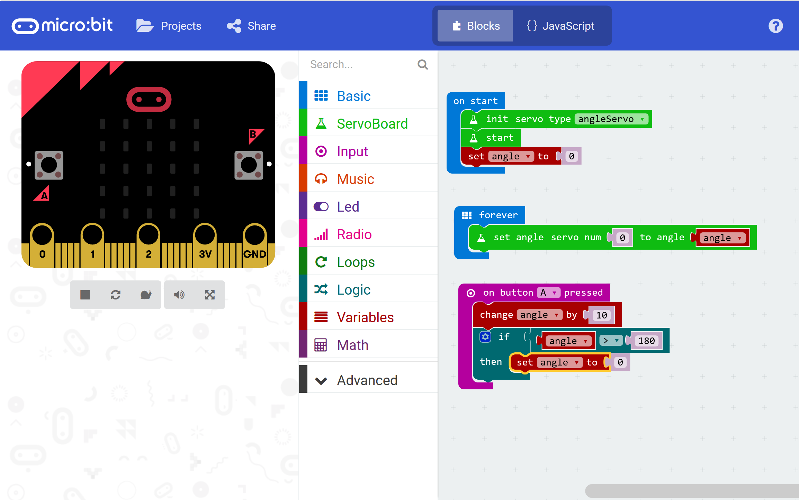

*************
Moving motors
*************
-----------------
Set up the motors
-----------------
Click on the ServoBoard menu so that you can see the blocks.

Now drag out the blocks that will set up the motors and place them in the `start
up` jaws so that your code looks like this:

--------------------
Make the motors move
--------------------
Now we will add some code to move the motor rotor every time that you press the button.

First we will need to keep a counter, called a variable, in which we will store the current angle of the motor. You can do that by opening the Variables menu and choosing `Make a variable`:

Name the variable `angle`.

Now you can add the rest of the code to change the angle of the motor.  

What happens when the angle reaches 180°? Try it out.
