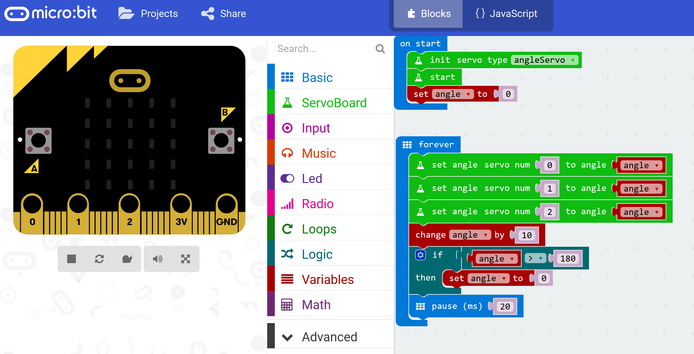
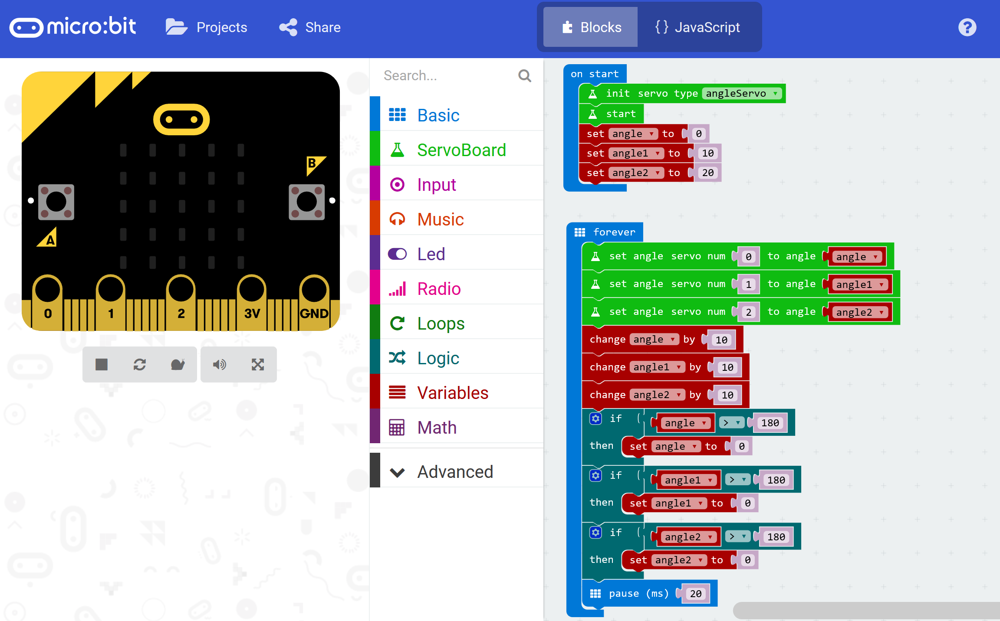

********************
More than one motor
********************
You are now ready to move more than one motor. Make sure that you have all the remaining motors plugged in to the PWM board.

--------------
Servos 1 and 2
--------------
So far your code just moves the motor plugged into slot 0 on the PWM board. You should add code to move the other two motors as well, like this:

You will notice that all of the motors are moving together at the same angle. This is progress but the caterpillar is not going to move very far!

----------------
Is it crawling?
----------------
Now it's time for you to experiment. Make two more variables ``angle1`` and ``angle2`` and initialise the new variables in the ``start`` loop. Add more code to increase the value of ``angle1`` and ``angle2`` in the ``forever`` loop and don't forget to check whether the value of the angle is greater than 180°.

Try it out. Upload your code to the micro:bit. Did it work? Keep experimenting until you are satisfied with the way that the caterpillar crawls.
