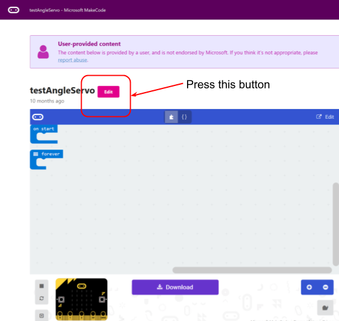

*****************
Get ready to code
*****************
We will be programming the micro:bit using the makecode programming environment
with some added software to drive the motors. Open a browser, and go to this
URL: `https://goo.gl/nKmyrn <https://makecode.microbit.org/_85wKMW2KM0u1>`_

When you see the screen below, press the ``Edit`` button.

You should see a screen like the one below and you are now ready to make the micro:bit, and your robot, do something.

.. image:: pictures/readyToCode.png
  :scale: 20%
